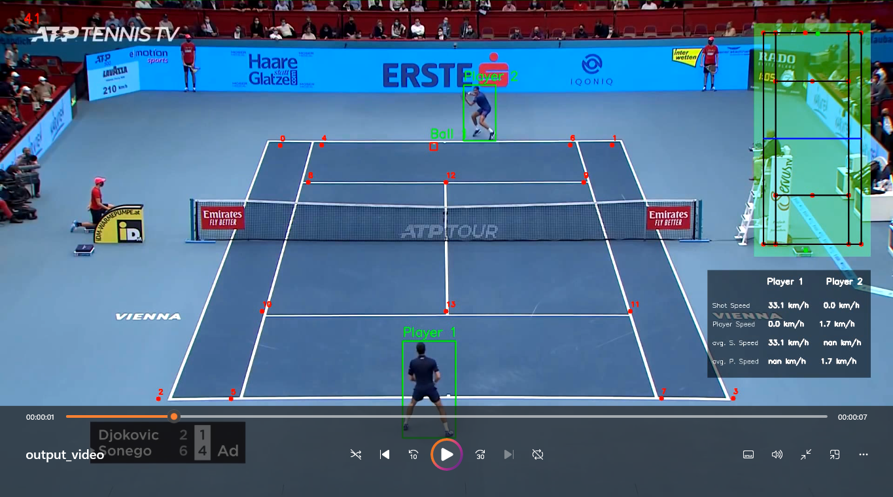

# Tennis-Analysis-UsingComputerVisions

## Introduction
This project uses computer vision to analyze tennis matches. The project uses YOLO to detect the ball and players in the video frames. It then tracks the ball and players to analyze their movements and interactions. Tracking court keypoint was important to analyse movements and was achived by RESNET50 training the last layer.Moreover ball tracking was improved by training Yolo model on robuflow dataset.

## Results

## Model
YOLOv8 for player detection and ball detection. RESNET50 for court keypoint detection. Finetuned YOLOv8 on Robuflow dataset for ball tracking.
Training training/tennis_court_keypoints_training.ipynb , training/tennis_ball_detector_training.ipynb

## Requirements
<ul>
    <li>Python 3.6</li>
    <li>OpenCV</li>
    <li>Tensorflow</li>
    <li>Ultralytics</li>
    <li>Robuflow</li>
    <li>numpy</li>
    <li>pytorch</li>
    <li>cv2</li>
</ul>

## Acknowledgement
<ul>
    <li>Yolo : https://pjreddie.com/darknet/yolo/</li>
    <li>RESNET50 : </li>
    <li>Robuflow(Ball tracking dataset) : https://universe.roboflow.com/viren-dhanwani/tennis-ball-detection</li>
    <li>Project Inspiration : https://www.youtube.com/watch?v=L23oIHZE14w</li>
</ul>

